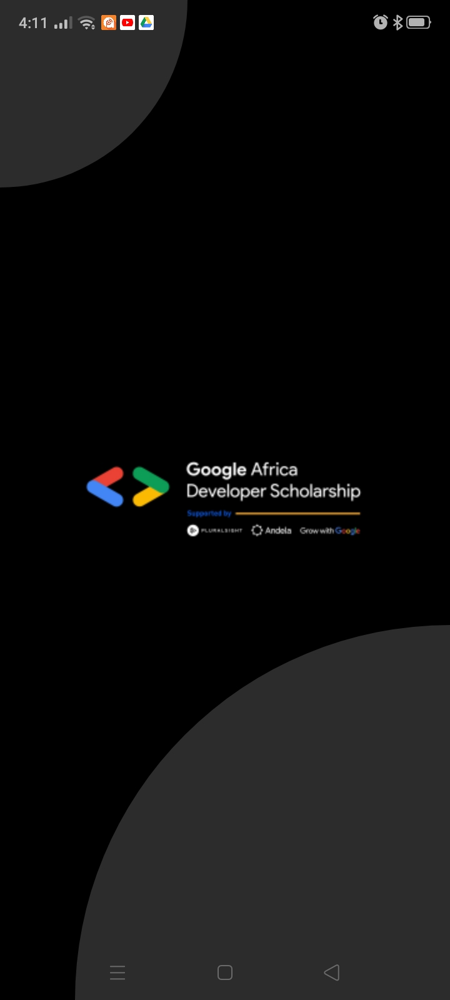
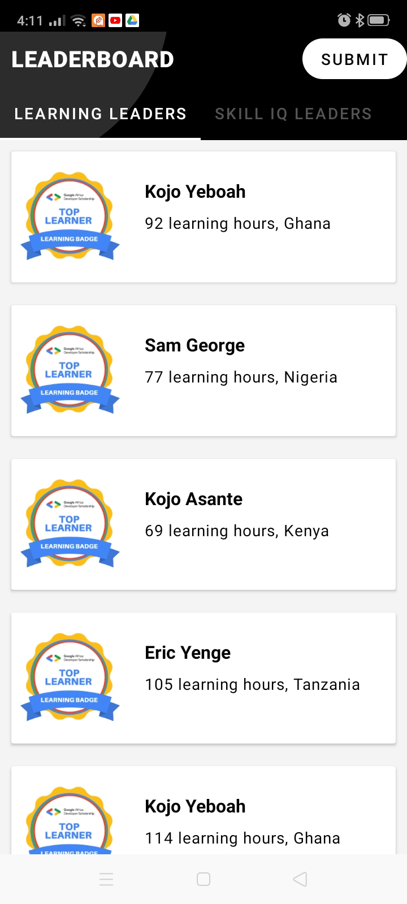
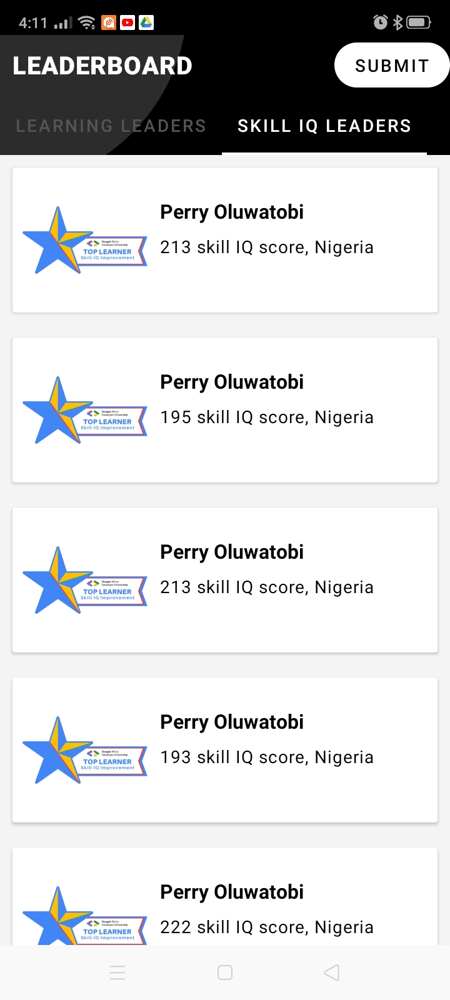
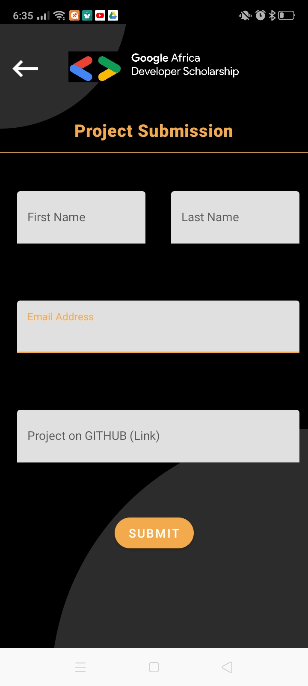
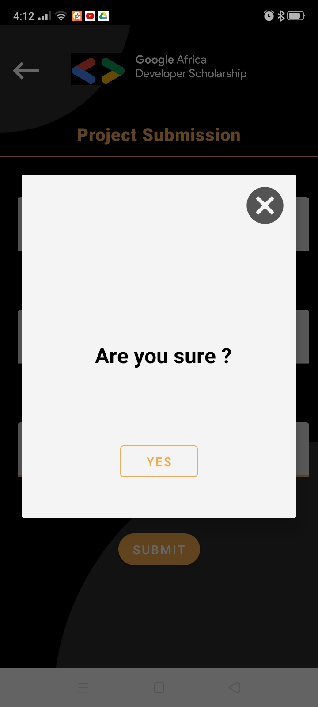
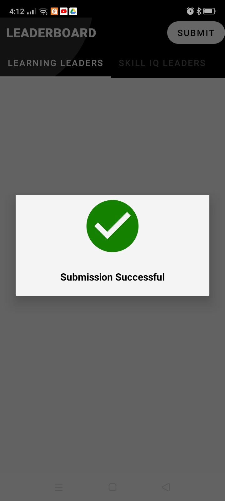

# GADS Practice Project
 The GADS leaderboard presented in Kotlin using clean architecture. 
Dependency injection enforced using Hilt.

##3rd Party Libraries
- [Retrofit](https://square.github.io/retrofit) - This is used to make Network calls.
- [Moshi](https://github.com/square/moshi) - This is used to convert JSON to Kotlin Data Classes.
- [Glide](https://github.com/bumptech/glide) - This is used to parse image urls from the web into images.

## Screenshots
| Splash Screen                | Learning leaders page                  | Skills IQ leaders                  |
|------------------------------|----------------------------------------|------------------------------------|
|  ||  |

| Submit page                  | Confirmation dialog                    | Success dialog                     |
|------------------------------|----------------------------------------|------------------------------------|
|  |          |      |